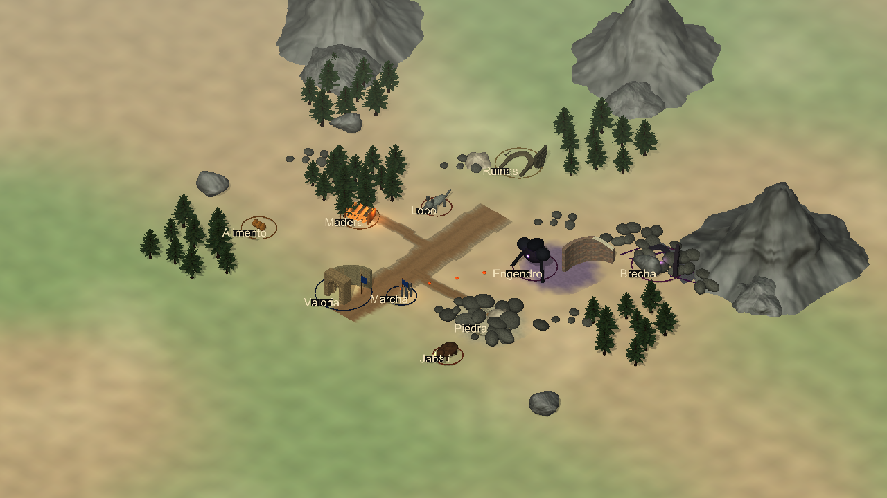
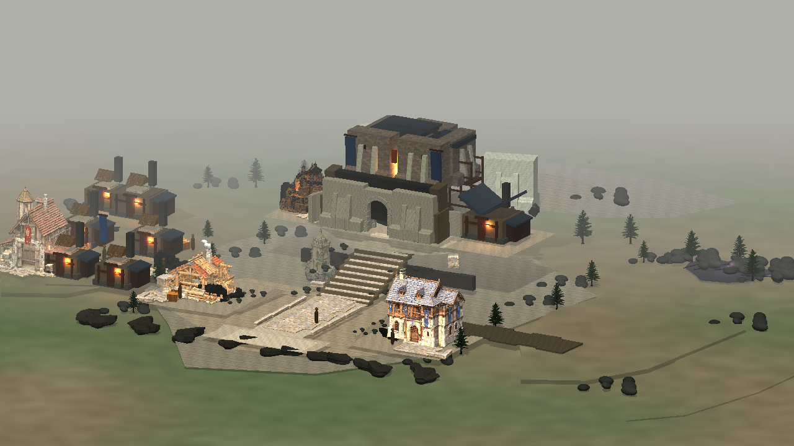

# Eldoria — integrated Work visual wedge v1

Source baseline: `f7dc22a2b7e52dba45cdcd296edea0a118dda80d`.
Production art source: `616d5f8e1e969e917f885c970562135e45fc2191`.
Scope: runtime Unity presentation only; canonical web v0.32.0 is unchanged. No purchases, no paid generation, no Tripo credits.

## Result and acceptance

The two wedges are integrated into the real runtime `VisualWorld` through `ProductionVisualIntegration`. They are not replacement art-test scenes. Technical/collision checks and the existing regression suite are green on the production source recorded above. The incremental world composition is now readable as a populated strategic region. Valoria's ground, street and small work-frontage integration improves over the baseline.

**The owner reference benchmark remains OPEN.** Valoria's Bastion and several civil bodies still retain provisional box-based architecture; the new masonry dressing does not certify final architectural identity. World beasts, the compact player city and the march are deliberate placeholders. Do not report this block as a final photoreal city or complete 4X asset library.

## Published runtime

Existing Publish Eldoria Preview run [36675166069](https://github.com/mt5hjfz2kb-lab/Eldoria-Prewiu/actions/runs/36675166069) completed SUCCESS on production source `616d5f8e1e969e917f885c970562135e45fc2191`: WebGL build, Pages deployment, frozen tester URL guard and Unity OWNER URL verification. Published runtime: [Unity OWNER I–II](https://mt5hjfz2kb-lab.github.io/Eldoria-Prewiu/unity-owner/?cb=616d5f8e). This is the existing functional I–II profile; the representative B3 art fixture in the matched screenshots does not add B3 gameplay. Published HTML was also fetched successfully and contains the Unity canvas and WebGL loader references. Interactive published Chromium was skipped by the existing Unity-only workflow; do not claim an additional browser interaction gate.

## Exact visual evidence

Final runs/artifacts:

| Gate | Run | Artifact | Result |
| --- | --- | --- | --- |
| World visual formula | [36675166099](https://github.com/mt5hjfz2kb-lab/Eldoria-Prewiu/actions/runs/36675166099) | [11080505091](https://github.com/mt5hjfz2kb-lab/Eldoria-Prewiu/actions/runs/36675166099/artifacts/11080505091) | SUCCESS |
| Valoria visual formula | [36675166037](https://github.com/mt5hjfz2kb-lab/Eldoria-Prewiu/actions/runs/36675166037) | [11079389658](https://github.com/mt5hjfz2kb-lab/Eldoria-Prewiu/actions/runs/36675166037/artifacts/11079389658) | SUCCESS |
| Full Unity slice | [36675166031](https://github.com/mt5hjfz2kb-lab/Eldoria-Prewiu/actions/runs/36675166031) | [11080426768](https://github.com/mt5hjfz2kb-lab/Eldoria-Prewiu/actions/runs/36675166031/artifacts/11080426768) checks + Windows player; [11080586086](https://github.com/mt5hjfz2kb-lab/Eldoria-Prewiu/actions/runs/36675166031/artifacts/11080586086) benchmark | SUCCESS |
| Existing isolated LookDev | [36646481115](https://github.com/mt5hjfz2kb-lab/Eldoria-Prewiu/actions/runs/36646481115) | [11069480273](https://github.com/mt5hjfz2kb-lab/Eldoria-Prewiu/actions/runs/36646481115/artifacts/11069480273) | SUCCESS; approved building surfaces unchanged since this gate |

Initial-main baselines use the first flag-off captures: world run 36644924930 / artifact 11067982288 / source 816dc351319931aa0a06ce728c3654c4f980cc7f; Valoria run 36644045308 / artifact 11067841196 / source b3d4eb3b8b49b77c5dd3def4418eaccf696f6a20. Those capture commits leave GroundKit/ValoriaKit unchanged from the initial f7dc22 baseline. Later gate-generated BEFORE images include the global GroundKit upward-face fix, so are retained as collision evidence but are not mislabeled as the original visual baseline.

Both sides use Bastion III, Aserradero I, Cuartel I and corruption discovered. World additionally uses outbound march to forest-valoria with eight ArcherT1. This is a representative art fixture; additional B3 beasts/food/ruins do not imply new Unity B3 gameplay parity.

| View | Fixed position → target | Required orthos |
| --- | --- | --- |
| World | (20,24,-21) → (0,0,1) | 18,14,10,7; 390×844 at 14 |
| Valoria | (18.2,14.6,-25.8) → (0,3.15,5.8) | 19,12,9; 390×844 at 12 |

West pan is (-13,-1.25,-4.4); threat pan is (6,0,5), keeping the same orientation. No free orbit, new lighting or retouching was used to favor AFTER. Comparison panels only add headers outside original pixels. Original-image hashes, dimensions, fixture and camera data are in `evidence/work-visual-integration-v1/evidence-manifest.json`.

[World before/after](evidence/work-visual-integration-v1/mapa-before-after.png) · [Valoria before/after](evidence/work-visual-integration-v1/valoria-before-after.png) · [World mobile](evidence/work-visual-integration-v1/mapa-mobile-before-after.png) · [Valoria mobile](evidence/work-visual-integration-v1/valoria-mobile-before-after.png).

The unchanged owner reference SHA-256 is 43fcd6f845747b20ccca71c4a5ba43985c86f9e22042a3f24faedf680eab3835. It sets aspiration, not gameplay geometry.

## Reuse actually integrated

| Existing family | Production role in this block |
| --- | --- |
| Frontier + WorldRouteKit + WorldResourceKit | Preserve authoritative targets and semantic route/quarry pockets; blend their visual terrain surfaces and add two resource access strips |
| Holotna Mountain | Three mountain barriers, rocks/skirts, 49 mapped trees in five clusters; two tree variants also replace city cones at existing tree origins |
| Quaternius Arch_Gothic / Wall_Broken / Column_Round | Neutral ruins and secondary hostile ruin dressing, with aged Eldoria masonry |
| Existing corruption language | Preserve scar, hostile target and existing threat meaning; suppress no gameplay |
| Mega Fantasy Props source FBX | Compact player-city placeholder and Bastion masonry facings, preserving the original building envelope |
| Slavic selected hard surface | Roof support, shed/firewood, stone fence, crates, barrels and sacks where source geometry fits |
| Ground Kit v1 | Existing streets, courts and retaining surfaces; correct downward triangle winding so authored ground faces render from above |
| StoneKit pieces 01–06 | Street slabs, irregular courts/transitions, curbs, corners, thin skins on the exact twelve treads, small cheek accents and foundation stones |
| Aserradero / Cuartel / Granero | Existing dedicated production geometry, materials, plot poses and visibility contract retained |
| ResidentialTerraceRock / RockTerrainSeamFiller | Existing upper residence and seam instances retained in the expanded city |
| TowerWallRock | Exact historical source recovered through the existing Surface pipeline; one decorative flank outside the stair corridor |

Six StoneKit source GLBs remain independent and byte-unchanged, totaling 49,791 triangles. Their byte-identical albedo/normal/MR atlases share one runtime material. No generation occurred.

TowerWallRock recovery uses raw source SHA 18785f7ba607cef1e7dcee45684d65c3166dc47b0f73b4bc4fb3d295c6f53a6a and promoted 50K GLB SHA 02692428311756ba37aace05da6a77146e18b4038eac27e2440b18aaf6bc1687. Its historical baked atlas contains unmapped black UV regions; the integrated flank therefore uses the existing city stone/earth surfaces while preserving geometry, UVs and normals. This is decorative support, not a new certified stair or final HERO.

NatureStarterKit2 was not promoted: it did not add a better coherent forest language. Slavic foliage remains rejected. Redundant/occluded tower placements and ground-level whole-house replacements were removed; current support roofs fit the certified existing house levels.

## Safety and validation

Full Unity run 36675166031 completed SUCCESS: source preflight, EditMode, PlayMode, Windows player build and Valoria benchmark. The existing suite includes fresh-save I–II progression, actual building-panel clicks from the official camera, camera pan/tap-vs-drag, the twelve-stair circulation contract, progression visibility, GroundKit UV/tiling and Frontier route/resource semantics. Tests were not weakened or changed. Existing Aserradero/Cuartel/Granero source art and functional poses remain unchanged.

Before/after enabled collider + hotspot signatures are equal in both existing visual gates. Every added collider is disabled; no imported hotspot owns gameplay. Certified routes, twelve stairs, functional plots, `Valoria.unity`, `Frontier.unity`, Domain/Application/Infrastructure and canonical web source are unchanged relative to the initial main.

The terrain material keeps the certified fourfold texture scale with compensating global UVs, preserving its visual sampling. Actual scene material passes are compiled synchronously before screenshot readback; this avoids the temporary editor blue compilation shader on first far frames. This is capture correctness, not image retouching.

The optional NatureStarter diagnostic may compress below 10KB; its image guard is 500 bytes. All production evidence keeps the original 10KB guard. The existing pack comparison is manual/read-only; one-time recovery/export hooks were removed. No parallel Blender/capture workflow was added. Windows work remains sequential on the existing runner.

Final B3 art fixture: **1,174,540 triangles / 913 active renderers / 86 unique materials / 15 lights**. These are measured scene-complexity values, not an Android budget or measured FPS. All StoneKit renderers bind one shared material/atlas set. The six source assets still embed independent textures; peak memory and build-payload deduplication are not certified by this change.

390×844 evidence is an editor viewport check, not physical-phone FPS/memory certification. Existing Android prerequisites/device profiling remains open.

## Visible gaps mapped to the master roadmap

| Visible remaining gap | Exact master roadmap entry |
| --- | --- |
| Small legacy gate/tower origin, only one city silhouette/tier | A2.1 Player City Kit v1 |
| Food bundles and generic stock/quarry presentation; no depletion/abundance variants or iron family | A2.2 Resource Node Kit v1 |
| Wolf/boar primitive bodies and existing provisional Engendro | A2.3 Beast Kit v1 |
| Ruin/Breach staging lacks final distinct installation identities and states | A2.4 Installation / POI Kit v1 |
| Capsule party and banner; no final troop silhouettes, ownership variants or animated heading/state | A2.5 March Representation Kit v1 |
| Bastion, retaining planes and some civil bodies still read as provisional box construction | B2.1 Stone Architecture Kit v1 |
| West housing bodies and repeated roofs remain incomplete civil architecture | B2.2 Residential Support Kit v1; B2.3 Roof / Facade Variation Kit v1 |
| Workers remain small deliberate capsule symbols; work-frontage props only cover part of inhabited dressing | B2.4 Urban Props Kit v1 / existing inhabited-support layer |

Cantera, Forja and Hospital remain future B2.5–7 gaps. No final substitute buildings or new plots were invented.

## Only three next library families

1. **Stone Architecture Kit v1** — the dominant unfilled Valoria screen area is structural masonry/retaining architecture; a reusable kit can replace repeated provisional planes across hero/support interfaces.
2. **Player City Kit v1** — the populated map now exposes the player origin as a small legacy gate placeholder; readable strategic city tiers/ownership give the largest missing strategic landmark.
3. **Beast Kit v1** — the composition distinguishes wolf, boar and threat sites, but their actual silhouettes remain primitive; this kit closes the most visible PvE identity gap.

Other observed gaps stay mapped above; they are not a new acquisition wishlist.
